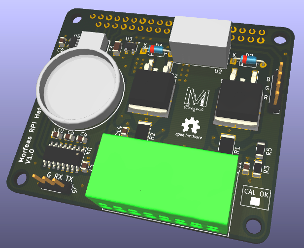

<div align="center">  </div>

# Morfeas PRi Hat
This repository related to Supporting software, PCB and Mechanical design for the Morfeas RPi Hat.

The PCB designed using [KiCAD EDA](https://kicad-pcb.org/), A Libre(free) Electronic CAD/CAM software.<br>
The mechanical design of the enclosures designed using [FreeCAD](https://www.freecadweb.org/), A Libre(free) Mechanical/Architecture CAD/CAM Software.<br>
The software for the Morfeas RPi Hat written in ANSI C and is compatible with GNU operating system.<br>

### Requirements
For compilation of this project the following dependencies are required.
* [GCC](https://gcc.gnu.org/) - The GNU Compilers Collection
* [GNU Make](https://www.gnu.org/software/make/) - GNU make utility
* [NCURSES](https://www.gnu.org/software/ncurses/ncurses.html) - A free (libre) software emulation library of curses.
* [GLib](https://wiki.gnome.org/Projects/GLib) - GNOME core application building blocks libraries.
* [LibGTop](https://developer.gnome.org/libgtop/stable/) - A library to get system specific data.
* [libi2c](https://packages.debian.org/jessie/libi2c-dev) - A library that provide I2C functionality to Userspace
* [libmodbus](https://www.libmodbus.org/) - A free software library for communication via ModBus protocol.

##### Optionally
* [I2C-tools](https://packages.debian.org/jessie/i2c-tools) - Heterogeneous set of I2C tools for Linux kernel

### Compilation
To compile the program (tested under GNU/Linux only)
```
$ # Make the compilation directory tree
$ make tree
$ make
```
The executable binary located under the **./build** directory.

### Installation
```
$ sudo make install
```
### Un-installation
```
$ sudo make uninstall
```
### Usage: Morfeas_RPi_Hat
```
Usage: Morfeas_RPi_Hat [Options]

	Options:
	         -h : Print Help
	         -v : Print Version
	         -b : I2C Bus number (default 1)

		-----Morfeas_RPi_Hat Shell-----
KEYS:
 	KEY_UP    = Buffer up
	KEY_DOWN  = Buffer Down
	KEY_LEFT  = Cursor move left by 1
	KEY_RIGTH = Cursor move Right by 1
	Ctrl + C  = Clear current buffer
	Ctrl + L  = Clear screen
	Ctrl + I  = print used CAN-if
	Ctrl + Q  = Quit
COMMANDS:
	meas p# = Print measurement of Port's CSA
	config p# = Print Port's Configuration
	set p# czero = Set port's current zero offset
	set p# vzero = Set port's voltage zero offset
	set p# vgain Ref_value = Calculate and set CSA's voltage gain at Reference value
	set p# cgain Ref_value = Calculate and set CSA's current gain at Reference value
	save p# = Save Port's configuration to EEPROM
```

## Documentation
The documentation is located under the [Docs](./Docs) directory.

## Authors
* **Sam Harry Tzavaras** - *Initial work*
## License
The PCB design is licensed under TAPRv1 or later - see the [License](./Hardware/TAPR_Open_Hardware_License_v1.0.pdf) file for details.

The Source code is licensed under GPLv3 or later - see the [License](../blob/master/LICENSE) file for details.

The Technical Reference is licensed under FDLv1.3 or later - see the [License](../../fdl-1.3.md) file for details.
